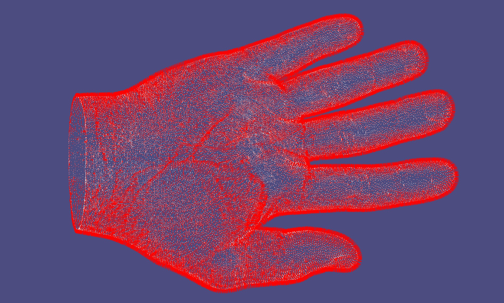
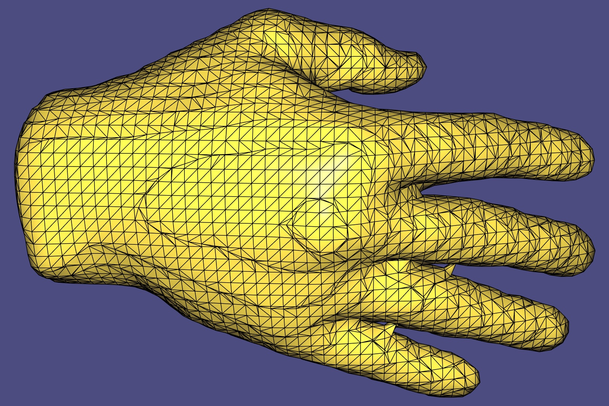
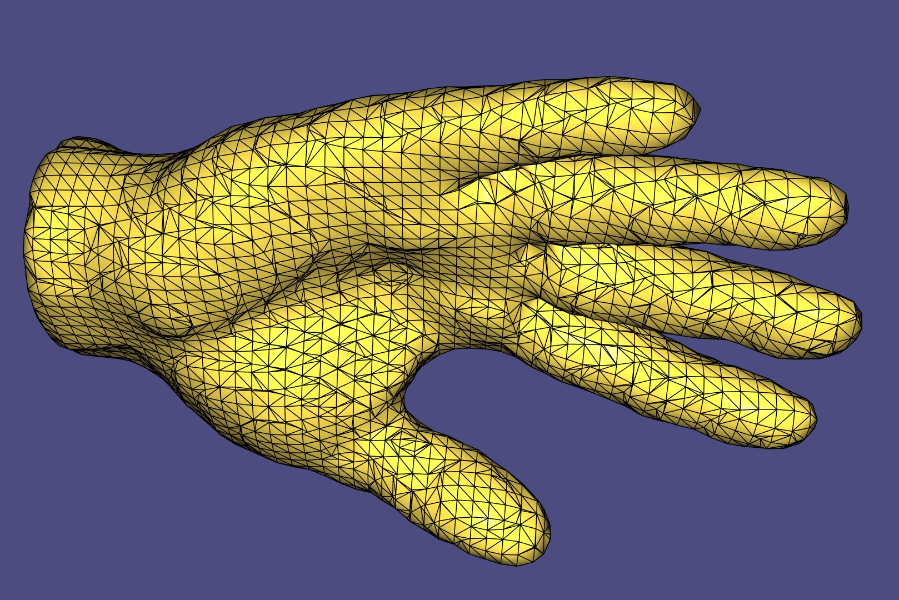

#  Submission for Poisson Mesh Reconstruction Assignment

I cloned the original [assignment repo](https://github.com/alecjacobson/geometry-processing-mesh-reconstruction) and
after reading ["Poisson Surface Reconstruction" by Kazhdan et al. 2006.](papers/poisson-surface-reconstruction.pdf) as 
well as Alec Jacobson's very well written assignment README, I implemented poisson surface reconstruction. The major 
difference between the paper and the method students are lead to implement is that the problem is set up and solved on 
a fixed grid instead of an adaptive grid as described in the paper.

The input is a point cloud of normals. The screenshot below is one of the provided inputs. The implemented method 
outputs a mesh (vertices and faces), the second screenshot below is the mesh produced from hand scan, visualized in the 
screenshot immediately below.

[CGAL](www.cgal.org) has an implementation of [poisson surface reconstruction](https://doc.cgal.org/latest/Poisson_surface_reconstruction_3/index.html#Chapter_Poisson_Surface_Reconstruction) 
that is worth looking at.
